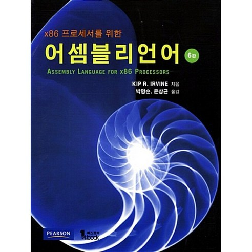

# 2025-Assembly-Language
2025년 중앙대학교 &lt;컴퓨터 시스템 및 어셈블리 언어> 
 
어셈블리언어 수업을 수강하며 매주 실습 시간의 코드를 올립니다. 
**후기**  
어셈블리어는 컴퓨터공학 프로그래밍 언어의 근본이기 때문에 배우는 내내 어께가 올라가는 느낌이었다. 
visual studio 2022 상에서 'Irvine.32'를 연결하여 여러 프로시저를 사용할 수 있는데, 
이 수업을 통해 중단점(breakpoint)를 설정하고 f10, f11로 진행하며 레지스터를 확인하는 방법을 거의 매주 진행하였는데 
컴퓨터 메모리 구조를 조금 더 이해하게 되었다. 

